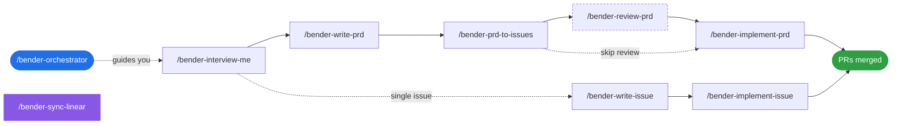

<div align="center">

# plan-bender

[](https://github.com/jasonraimondi/plan-bender/releases)
[](https://go.dev)
[](LICENSE)
[](#install)

**Structured planning pipeline for AI coding agents — from interview to implementation.**

[Install](#install) • [Quickstart](#quickstart) • [How it works](#how-it-works) • [Skills](#skills) • [Dispatch](#autonomous-dispatch) • [Configuration](#configuration) • [Docs](#docs)

</div>

---

plan-bender turns vague product ideas into thin, dependency-ordered, agent-ready issues — and then drives an AI coding agent through them. It ships as two small Go binaries plus a set of agent skills (slash commands) that orchestrate the pipeline:

```
interview ──► PRD ──► thin-sliced issues ──► implementation ──► PR
```

It is **not** an agent runtime. It writes YAML and skill markdown; your agent (Claude Code, opencode, openclaw, or Pi) does the work. The `pba dispatch` loop fans out parallel git worktrees so multiple AFK issues can run concurrently.

> [!NOTE]
> plan-bender is pre-1.0. The CLI surface is stable for day-to-day use but expect rough edges. Feedback and issues welcome.

## Features

- **Opinionated planning workflow** — interview → PRD → issues → review → implement, each step a dedicated skill
- **Thin vertical slices** — hard `max_points: 3` cap forces decomposition into tracer-bullet issues
- **Autonomous dispatch** — `pba dispatch` runs the implementation loop end-to-end with parallel worktrees, dependency-ordered merge-back, and lifecycle hooks
- **YAML state** — PRDs and issues live in `.plan-bender/plans/<slug>/` next to your code, diffable and reviewable
- **Multi-agent** — emits skills for `claude-code`, `opencode`, `openclaw`, and `pi`
- **Optional Linear backend** — sync local issues with a Linear project; local YAML stays the source of truth
- **Structured CLI** — `plan-bender-agent` (`pba`) returns JSON for agents to consume; `plan-bender` (`pb`) is the human-friendly twin

## Install

### One-liner (macOS/Linux)

```sh
curl -fsSL https://raw.githubusercontent.com/jasonraimondi/plan-bender/main/install.sh | bash
```

Installs `plan-bender` and `plan-bender-agent` to `~/.local/bin` and symlinks `pb` and `pba`.

### With Go

```sh
go install github.com/jasonraimondi/plan-bender/cmd/plan-bender@latest
go install github.com/jasonraimondi/plan-bender/cmd/plan-bender-agent@latest
```

> [!TIP]
> The Go install path won't create the `pb` / `pba` shortcuts. Symlink them yourself, or use the install script.

### Verify

```sh
pb doctor
```

## Quickstart

From the root of any git repo:

```sh
pb setup
```

This writes `.plan-bender.yaml`, generates skill files for the agents you've enabled, and (optionally) adds entries to `.gitignore`. It's idempotent — re-run anytime to regenerate skills after a config change.

Then, in your agent of choice, invoke the orchestrator:

```
/bender-orchestrator
```

The orchestrator reads your plan state and offers a menu of next actions: start an interview, write a PRD, decompose into issues, review, or implement.

## How it works

plan-bender is a methodology made executable. Each phase has a dedicated skill the agent runs; each skill calls the `pba` CLI to read or write structured YAML.

| Phase | Skill | Output |
| --- | --- | --- |
| Discovery | `/bender-interview-me` | Stress-tested idea, surfaced assumptions |
| PRD | `/bender-write-prd` | `prd.yaml` with scope, decisions, validation |
| Decomposition | `/bender-prd-to-issues` | Thin-sliced issues with dep graph and tracks |
| Review | `/bender-review-prd` | Principal-engineer pass with auto-fix |
| Implementation | `/bender-implement-prd` | `pba dispatch` runs all AFK issues |
| Single issue | `/bender-implement-issue` | Branch → code → test → PR |

### Plan layout

```
.plan-bender/plans/auth-system/
  prd.yaml
  issues/
    1-setup-middleware.yaml
    2-add-token-refresh.yaml
    3-add-role-checks.yaml
```

A minimal issue:

```yaml
id: 1
slug: setup-middleware
name: "Set up authentication middleware"
track: rules                       # intent | experience | data | rules | resilience
status: todo
points: 2                          # hard-capped at max_points (default 3)
labels: [AFK]                      # AFK = autonomous, HITL = needs human input
blocked_by: []
blocking: [2, 3]
tdd: true                          # write tests first
acceptance_criteria:
  - "Valid JWT → user context on request"
  - "Expired JWT → 401"
steps:
  - "Auth middleware — reject malformed Authorization header"
  - "Auth middleware — decode JWT, verify signature and expiry"
```

See [docs/schema.md](docs/schema.md) for the full schema.

## Skills

Slash commands generated by `pb setup` into the per-agent skill directory. Call `/bender-orchestrator` to be guided, or invoke any step directly:




| Skill | What it does |
| --- | --- |
| `/bender-orchestrator` | Menu-driven entry point — lists active plans and next actions |
| `/bender-interview-me` | Stress-test an idea before writing anything |
| `/bender-write-prd` | Interview + explore codebase + write `prd.yaml` |
| `/bender-write-issue` | Create a single issue |
| `/bender-prd-to-issues` | Decompose PRD into thin vertical-slice issues |
| `/bender-review-prd` | Principal-engineer review with auto-fix |
| `/bender-implement-prd` | Run `pba dispatch` to work all issues in dependency order |
| `/bender-implement-issue` | One issue end-to-end: branch, code, test, PR |
| `/bender-sync-linear` | Sync plan with Linear (Linear backend only) |

## Autonomous dispatch

`pba dispatch <slug>` is the autonomous loop behind `/bender-implement-prd`. It:

1. Resolves an integration branch from `pipeline.branch_strategy` (`integration` creates `<git-user>/<slug>` off the default branch; `direct` merges straight to default).
2. Computes the next batch of unblocked AFK issues.
3. For each issue: creates a worktree → atomically claims it (`status: in-progress` + `branch:`) → runs `before_issue` hook → spawns `claude --print` in the worktree → runs `after_issue` hook.
4. Per-subprocess transcripts stream as `[issue-N] …` and land in `.plan-bender/logs/<slug>/<id>.log`. Each subprocess is capped by `pipeline.subprocess_timeout` (default `30m`).
5. Merges successful branches into the integration branch in dependency order, flipping each merged issue to `done`. Conflicts mark the issue `blocked` and abort.
6. Runs the `after_batch` hook in the repo root.

> [!IMPORTANT]
> Dispatch refuses to run with a dirty working tree. It captures and restores `HEAD` on exit so a successful run never silently leaves you on the integration branch.

**Exit codes:** `0` (all done) • `2` (only HITL issues remain) • `1` (failure — stuck-on-blocked, dirty repo, etc.)

### Recovering from a stuck dispatch

```sh
pb status <slug>            # see per-issue state and failure notes
# fix the underlying problem
pb retry <slug> <id>        # flip blocked → todo, clear notes
pb dispatch <slug>          # resume
```

## Configuration

Three layers, deep-merged (later wins):

| File | Scope |
| --- | --- |
| `~/.config/plan-bender/defaults.yaml` | Global, shared across projects |
| `.plan-bender.yaml` | Project, committed to repo |
| `.plan-bender.local.yaml` | Local, gitignored — secrets go here |

A minimal project config:

```yaml
plans_dir: ./.plan-bender/plans/
max_points: 3
agents:
  claude-code: true
  pi: true
```

For the full reference (tracks, workflow states, hooks, custom fields, Linear, templates) see [docs/configuration.md](docs/configuration.md), or print it inline:

```sh
pb docs --full
```

### Supported agents

| Agent | Skill directory | Scope |
| --- | --- | --- |
| `claude-code` | `.claude/skills/` | Project or user |
| `opencode` | `.opencode/skills/` | Project or user |
| `openclaw` | `~/.openclaw/skills/` | User only |
| `pi` | `.pi/skills/` | Project or user |

## Linear integration

Drop credentials in `.plan-bender.local.yaml` (gitignored — never commit them):

```yaml
linear:
  enabled: true
  api_key: $LINEAR_API_KEY      # $VAR / ${VAR} expanded at load time
  team: $LINEAR_TEAM_ID
  project_id: ""                 # optional
  status_map:
    in-progress: "In Progress"
    in-review: "In Review"
```

Then sync:

```sh
pb sync linear push <slug>     # local YAML → Linear
pb sync linear pull <slug>     # Linear → local YAML
```

Local YAML remains the source of truth; Linear mirrors it.

## CLI reference

`pb` is the human CLI; `pba` (`plan-bender-agent`) emits JSON and is what skills shell out to.

```sh
pb setup                       # idempotent — write config + regenerate skills
pb next <slug>                 # recommended next issue
pb status <slug>               # per-issue state + failure notes
pb dispatch <slug>             # autonomous loop
pb complete <slug> <id>        # flip to in-review (used by sub-agents)
pb retry <slug> <id>           # blocked → todo, clear notes
pb worktree create <slug> <id> # branch + worktree for one issue
pb worktree gc <slug>          # clean up merged branches/worktrees
pb sync linear <push|pull> <slug>
pb doctor                      # verify install
pb self-update                 # update to latest release
```

Full table (including every `pba` subcommand and JSON shape) in [docs/cli.md](docs/cli.md).

## Docs

- [CLI reference](docs/cli.md) — every command, dispatch lifecycle, recovery
- [Configuration](docs/configuration.md) — full config keys, templates, agents
- [Schema](docs/schema.md) — PRD and issue YAML shapes

## License

[MIT](LICENSE)
