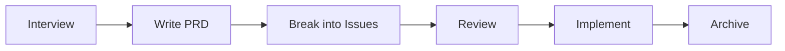

# plan-bender

Structured planning pipeline for Claude Code. Interview, PRD, issues, review, implement, archive — driven by YAML and slash commands.

## Quick start

```bash
npm install -g @jasonraimondi/plan-bender    # or npx @jasonraimondi/plan-bender
pb init                        # interactive setup → plan-bender.yaml
pb install                     # symlink skills into Claude Code
```

Then in Claude Code:

```
/bender-orchestrator           # shows your plans, suggests next action
```

## Pipeline



Each stage is a Claude Code skill. You can enter at any point or skip stages entirely.

## Skills

| Slash command | What it does |
|---------------|-------------|
| `/bender-orchestrator` | Menu — shows plans, suggests next action |
| `/bender-interview-me` | Stress-test an idea before writing anything |
| `/bender-write-a-prd` | Interview → explore codebase → write `prd.yaml` |
| `/bender-prd-to-issues` | Decompose PRD into thin vertical-slice issues |
| `/bender-write-an-issue` | Create a single issue |
| `/bender-review-prd` | Principal-engineer review with auto-fix |
| `/bender-implement-prd` | Work all issues in dependency order |
| `/bender-implement-issue` | One issue end-to-end: branch, code, test, PR |

Skip skills you don't need: `pipeline.skip: [bender-interview-me]` in config.

## Commands

| Command | What it does |
|---------|-------------|
| `pb init` | Interactive setup |
| `pb generate-skills` | Re-render skills from templates + config |
| `pb install` | Symlink skills into Claude Code |
| `pb validate <slug>` | Schema checks, cross-refs, cycle detection |
| `pb write-prd <slug>` | Validate + atomically write a PRD |
| `pb write-issue <slug> <id>` | Validate + atomically write an issue |
| `pb sync <slug>` | Push to backend (`--pull` to pull, `<slug>#<id>` for one issue) |
| `pb status [slug]` | Dashboard — all plans or per-issue detail |
| `pb graph <slug>` | Mermaid dependency DAG |
| `pb archive <slug>` | Move to `.archive/` with summary |

## Configuration

Three layers, deep-merged (later wins):

- `~/.config/plan-bender/defaults.yaml` — shared across projects
- `plan-bender.yaml` — committed to repo
- `plan-bender.local.yaml` — gitignored (secrets, personal overrides)

```yaml
backend: yaml-fs               # yaml-fs | linear
install_target: project        # project (.claude/skills/) | user (~/.claude/skills/)
plans_dir: ./plans/
max_points: 3                  # cap per issue — forces thin slices
step_pattern: "Target — behavior"

tracks:                        # classify issues by concern
  - intent                     # API endpoints, service wiring, core flow
  - experience                 # UI, navigation, visual feedback
  - data                       # schema, migrations, CRUD, queries
  - rules                      # auth, validation, business rules
  - resilience                 # error handling, retries, fallbacks

workflow_states:               # issue lifecycle
  - backlog
  - todo
  - in-progress
  - blocked
  - in-review
  - qa
  - done
  - canceled

pipeline:
  skip: []                     # skill names to exclude

issue_schema:
  custom_fields:               # extend issues with typed fields
    - name: team
      type: enum               # string | number | boolean | enum
      required: true
      enum_values: [frontend, backend, platform]

# required when backend: linear — put api_key in plan-bender.local.yaml
linear:
  api_key: "lin_api_..."
  team: "TEAM-ID"
  status_map:                  # local state → Linear state name
    in-progress: "In Progress"
    in-review: "In Review"
```

Tracks and workflow states are fully customizable. The defaults are a starting point.

## Plan structure

```
plans/
  auth-system/
    prd.yaml
    issues/
      1-setup-middleware.yaml
      2-add-token-refresh.yaml
      3-add-role-checks.yaml
  .archive/
```

### PRD example

```yaml
name: "Auth System"
slug: auth-system
status: draft                  # draft | active | in-review | approved | complete | archived
created: 2025-03-15
updated: 2025-03-15

description: "JWT-based auth with token refresh and role-based access."
why: "API endpoints are unprotected. Any request can access any resource."
outcome: "All API routes require valid auth. Roles control access. Tokens refresh transparently."

in_scope:
  - "JWT validation middleware"
  - "Token refresh endpoint"
  - "Role-based route guards"
out_of_scope:
  - "Social login providers"
  - "MFA"

use_cases:                     # numbered — issues reference these
  - id: UC-1
    description: "User logs in with email and password, receives access + refresh tokens"
  - id: UC-2
    description: "Expired access token is refreshed transparently using refresh token"
  - id: UC-3
    description: "Admin-only route rejects non-admin users with 403"

decisions:
  - "Short-lived JWTs (15m) + long-lived refresh tokens (7d)"
  - "Refresh tokens stored in httpOnly cookies, not localStorage"
open_questions:
  - "Do we need to support multiple concurrent sessions per user?"
risks:
  - "Token revocation requires a blocklist store — adds Redis dependency"
validation:
  - "All use cases pass integration tests"
  - "Auth middleware adds < 5ms p99 latency"

dev_command: "npm run dev"     # optional — used by implementation skills
base_url: "http://localhost:3000"
notes: null
```

### Issue example

```yaml
id: 1
slug: setup-middleware
name: "Set up authentication middleware"
track: rules                   # from config.tracks
status: backlog                # from config.workflow_states
priority: high                 # urgent | high | medium | low
points: 2                     # 1 to config.max_points
labels: [AFK]                 # AFK = autonomous | HITL = needs human input
assignee: null
blocked_by: []                # issue IDs that must complete first
blocking: [2, 3]              # issue IDs this unblocks
branch: null                  # set during implementation
pr: null                      # set when PR is opened
linear_id: null               # set by pb sync
created: 2025-03-15
updated: 2025-03-15
tdd: true                     # use test-driven development
headed: false                 # use browser verification

outcome: "Auth middleware validates JWTs and attaches user context to requests."
scope: "Middleware only — no login UI, no token issuance."

acceptance_criteria:
  - "Valid JWT → user context on request"
  - "Expired JWT → 401"
  - "Missing JWT → 401"

steps:                        # "Target — behavior" (matches config.step_pattern)
  - "Auth middleware — reject requests with missing or malformed Authorization header"
  - "Auth middleware — decode JWT, verify signature and expiry"
  - "Auth middleware — attach decoded user context to request object"

use_cases: [UC-1]             # references PRD use case IDs
notes: null
```

**Key fields:**

- **`track`** — classifies the issue's primary concern. PRD-to-issues checks track coverage and flags gaps.
- **`tdd: true`** — implementation agent writes tests first from the steps, then makes them pass.
- **`headed: true`** — implementation agent verifies visual outcomes in a browser.
- **`AFK` / `HITL`** — AFK issues run autonomously. HITL issues pause for human input.
- **`blocked_by` / `blocking`** — dependency graph. `pb graph` renders it. Implementation respects ordering.
- **`steps`** — ordered implementation actions following `step_pattern`. Steps tell the agent *how to build*; acceptance criteria tell reviewers *what to verify*.

## Customizing templates

Skills are generated from `.skill.tmpl` files bundled with plan-bender. To override a template, copy it to `.plan-bender/templates/` and edit. Run `pb generate-skills` to re-render.

Template source: [`templates/`](./templates/)

## Tips

- **Start with the orchestrator.** It reads plan state and suggests the right next action.
- **Review before decomposing.** `/bender-review-prd` catches scope gaps before you create 15 issues.
- **Keep issues small.** `max_points` forces thin slices. If you can't split it, the scope is too broad.
- **Validate early.** `pb validate` catches schema errors, missing cross-refs, and dependency cycles.
- **Visualize dependencies.** `pb graph` shows the critical path at a glance.
- **Use local overrides.** `plan-bender.local.yaml` lets you experiment without touching committed config.
- **Skip what you don't use.** `pipeline.skip` removes skills from generation and the orchestrator menu.

## License

MIT
