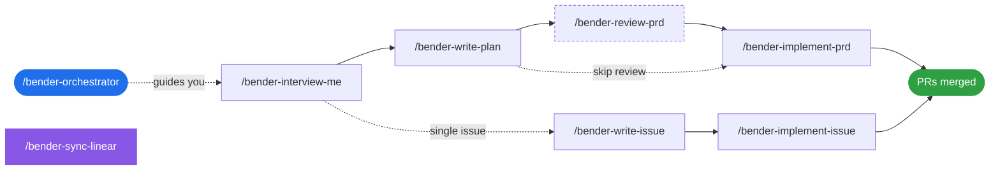

<div align="center">

# plan-bender

[](https://github.com/jasonraimondi/plan-bender/releases)
[](https://go.dev)
[](LICENSE)
[](#install)

**Structured planning pipeline for AI coding agents — from interview to implementation.**

[Install](#install) • [Quickstart](#quickstart) • [How it works](#how-it-works) • [Skills](#skills) • [Implement](#autonomous-implementation) • [Configuration](#configuration) • [Docs](#docs)

</div>

---

plan-bender turns vague product ideas into thin, dependency-ordered, agent-ready issues — and then drives an AI coding agent through them. It ships as two small Go binaries plus a set of agent skills (slash commands) that orchestrate the pipeline:

```
interview ──► PRD ──► thin-sliced issues ──► implementation ──► PR
```

It is **not** an agent runtime. It writes JSON and skill markdown; your agent (Claude Code, opencode, openclaw, or Pi) does the work. The `/bender-implement-prd` dispatcher fans out parallel git-worktree workers so independent issues run concurrently, merging each back in dependency order.

> [!NOTE]
> plan-bender is pre-1.0. The CLI surface is stable for day-to-day use but expect rough edges. Feedback and issues welcome.

## Features

- **Opinionated planning workflow** — interview → PRD → issues → review → implement, each step a dedicated skill
- **Thin vertical slices** — hard `max_points: 3` cap forces decomposition into tracer-bullet issues
- **Autonomous implementation** — the `/bender-implement-prd` dispatcher drives a loop of parallel git-worktree workers with dependency-ordered merge-back (`pba merge`) and lifecycle hooks
- **JSON state** — PRDs and issues live in `.plan-bender/plans/<slug>/` next to your code, diffable and reviewable
- **Multi-agent** — emits skills for `claude-code`, `opencode`, `openclaw`, and `pi`
- **Optional Linear backend** — sync local issues with a Linear project; local JSON stays the source of truth
- **Structured CLI** — `plan-bender-agent` (`pba`) returns JSON for agents to consume; `plan-bender` (`pb`) is the human-friendly twin

## Install

### One-liner (macOS/Linux)

```sh
curl -fsSL https://raw.githubusercontent.com/jasonraimondi/plan-bender/main/install.sh | bash
```

Installs `plan-bender` and `plan-bender-agent` to `~/.local/bin` and symlinks `pb` and `pba`.

### With Go

```sh
go install github.com/jasonraimondi/plan-bender/cmd/plan-bender@latest
go install github.com/jasonraimondi/plan-bender/cmd/plan-bender-agent@latest
```

> [!TIP]
> The Go install path won't create the `pb` / `pba` shortcuts. Symlink them yourself, or use the install script.

### Verify

```sh
pb doctor
```

## Quickstart

From the root of any git repo:

```sh
pb setup
```

This writes `.plan-bender.json`, generates skill files for the agents you've enabled, and (optionally) adds entries to `.gitignore`. It's idempotent — re-run anytime to regenerate skills after a config change.

Then, in your agent of choice, invoke the orchestrator:

```
/bender-orchestrator
```

The orchestrator reads your plan state and offers a menu of next actions: start an interview, write a PRD, decompose into issues, review, or implement.

## How it works

plan-bender is a methodology made executable. Each phase has a dedicated skill the agent runs; each skill calls the `pba` CLI to read or write structured JSON.

| Phase | Skill | Output |
| --- | --- | --- |
| Discovery | `/bender-interview-me` | Stress-tested idea, surfaced assumptions |
| Plan | `/bender-write-plan` | `prd.json` plus thin-sliced issues with dep graph and tracks, in one pass |
| Review | `/bender-review-prd` | Principal-engineer pass with auto-fix |
| Implementation | `/bender-implement-prd` | Parallel workers drive issues to done |
| Single issue | `/bender-implement-issue` | Branch → code → test → PR |

### Plan layout

```
.plan-bender/plans/auth-system/
  prd.json
  issues/
    1-setup-middleware.json
    2-add-token-refresh.json
    3-add-role-checks.json
```

A minimal issue:

```json
{
  "id": 1,
  "slug": "setup-middleware",
  "name": "Set up authentication middleware",
  "track": "rules",
  "status": "todo",
  "points": 2,
  "labels": ["AFK"],
  "blocked_by": [],
  "blocking": [2, 3],
  "tdd": true,
  "acceptance_criteria": [
    "Valid JWT → user context on request",
    "Expired JWT → 401"
  ],
  "steps": [
    "Auth middleware — reject malformed Authorization header",
    "Auth middleware — decode JWT, verify signature and expiry"
  ]
}
```

`track` is `intent` | `experience` | `data` | `rules` | `resilience`. `points` is hard-capped at `max_points` (default 3). `labels` use `AFK` or `HITL` as **escalation hints** — they tune how eagerly a worker escalates a human decision, not which issues are workable.

See [docs/schema.md](docs/schema.md) for the full schema.

## Skills

Slash commands generated by `pb setup` into the per-agent skill directory. Call `/bender-orchestrator` to be guided, or invoke any step directly:



```mermaid
flowchart LR
    O(["/bender-orchestrator"]):::entry
    I["/bender-interview-me"]
    P["/bender-write-plan"]
    R["/bender-review-prd"]:::optional
    M["/bender-implement-prd"]
    WI["/bender-write-issue"]
    II["/bender-implement-issue"]
    L["/bender-sync-linear"]:::side
    Done(["PRs merged"]):::done

    O -.guides you.-> I
    I --> P
    P --> R
    R --> M
    P -.skip review.-> M
    M --> Done

    I -.single issue.-> WI
    WI --> II
    II --> Done

    classDef entry fill:#1f6feb,stroke:#1f6feb,color:#fff
    classDef optional stroke-dasharray: 4 3
    classDef side fill:#8957e5,stroke:#8957e5,color:#fff
    classDef done fill:#2ea043,stroke:#2ea043,color:#fff
```

| Skill | What it does |
| --- | --- |
| `/bender-orchestrator` | Menu-driven entry point — lists active plans and next actions |
| `/bender-interview-me` | Stress-test an idea before writing anything |
| `/bender-write-plan` | Interview + explore codebase + write `prd.json` and decompose into issues in one pass |
| `/bender-write-issue` | Create a single issue |
| `/bender-review-prd` | Principal-engineer review with auto-fix |
| `/bender-implement-prd` | Drive parallel workers to implement all issues in dependency order |
| `/bender-implement-issue` | One issue end-to-end: branch, code, test, PR |
| `/bender-sync-linear` | Sync plan with Linear (Linear backend only) |

## Autonomous implementation

`/bender-implement-prd <slug>` is a live **dispatcher**: it drives the harness Workflow tool through a loop until the plan is stable.

1. **Scout** — selects the *ready* issues: those whose `blocked_by` are all `done` and whose status is `backlog`/`todo`/`in-progress`. Readiness is label-agnostic.
2. **Workers** — spawns one git-worktree-isolated worker per ready issue (`/bender-implement-issue`). Each claims its issue, implements and tests it, then signals one of three outcomes: `complete` (→ `in-review`), `park` (→ `needs-input`, a genuine human decision), or leaves it `blocked` (a technical failure).
3. **Merge** — `pba merge <slug>` integrates every `in-review`, dependency-satisfied issue into the integration branch in dependency order, flipping each to `done`. A conflict marks that issue `blocked` and aborts its merge; siblings still land. The `after_batch` hook runs in the integration worktree.
4. **Loop** — re-scouts and repeats. Between rounds it batches any `needs-input` issues into one round of questions, writes your decisions back into the issue JSON, and `retry`s them to `todo`.

When every issue is `done`, the dispatcher runs your chosen completion mode (`merge` / `branch` / `pr`). Issues left `blocked` or `needs-input` keep their dependents unready and are reported, not guessed.

All merge-back happens inside a dedicated per-slug integration worktree, so the parent repo's `HEAD` is never touched — you can keep working in it during a run (see [ADR-0003](docs/adr/0003-merge-in-dedicated-integration-worktree.md)).

> [!NOTE]
> The dispatcher drives the Claude Code **Workflow** tool, so the autonomous loop is Claude-Code-specific. The worker skill (`/bender-implement-issue`) stays portable across agents.

### Standalone merge-back

`pb merge <slug>` (or `pba merge`) runs just the dependency-ordered merge-back — integrating completed (`in-review`, deps-done) issues into the integration branch — without the dispatcher loop. It is idempotent and never moves the parent repo's `HEAD`.

### Recovering from a stuck issue

```sh
pb status <slug>            # see per-issue state and failure notes
# fix the underlying problem
pb retry <slug> <id>        # flip blocked/needs-input → todo (appends a note)
```

Then re-run `/bender-implement-prd <slug>` to pick up where it left off.

## Configuration

Three layers, deep-merged (later wins):

| File | Scope |
| --- | --- |
| `~/.config/plan-bender/defaults.json` | Global, shared across projects |
| `.plan-bender.json` | Project, committed to repo |
| `.plan-bender.local.json` | Local, gitignored — secrets go here |

A minimal project config:

```json
{
  "plans_dir": "./.plan-bender/plans/",
  "max_points": 3,
  "agents": {
    "claude-code": true,
    "pi": true
  }
}
```

For the full reference (tracks, workflow states, hooks, custom fields, Linear, templates) see [docs/configuration.md](docs/configuration.md), or print it inline:

```sh
pb docs --full
```

### Supported agents

| Agent | Skill directory | Scope |
| --- | --- | --- |
| `claude-code` | `.claude/skills/` | Project or user |
| `opencode` | `.opencode/skills/` | Project or user |
| `openclaw` | `~/.openclaw/skills/` | User only |
| `pi` | `.pi/skills/` | Project or user |

## Linear integration

Drop credentials in `.plan-bender.local.json` (gitignored — never commit them):

```json
{
  "linear": {
    "enabled": true,
    "api_key": "$LINEAR_API_KEY",
    "team": "$LINEAR_TEAM_ID",
    "project_id": "",
    "status_map": {
      "in-progress": "In Progress",
      "in-review": "In Review"
    }
  }
}
```

`$VAR` / `${VAR}` are expanded at load time. Then sync:

```sh
pb sync linear push <slug>     # local JSON → Linear
pb sync linear pull <slug>     # Linear → local JSON
```

Local JSON remains the source of truth; Linear mirrors it.

## CLI reference

`pb` is the human CLI; `pba` (`plan-bender-agent`) emits JSON and is what skills shell out to.

```sh
pb setup                       # idempotent — write config + regenerate skills
pb next <slug>                 # recommended next issue
pb status <slug>               # per-issue state + failure notes
pb merge <slug>                # merge completed issues in dependency order
pb complete <slug> <id>        # flip to in-review (used by sub-agents)
pb park <slug> <id>            # in-progress → needs-input (human decision)
pb retry <slug> <id>           # blocked/needs-input → todo
pb worktree create <slug> <id> # branch + worktree for one issue
pb worktree gc <slug>          # clean up merged branches/worktrees
pb sync linear <push|pull> <slug>
pb doctor                      # verify install
pb self-update                 # update to latest release
```

Full table (including every `pba` subcommand and JSON shape) in [docs/cli.md](docs/cli.md).

## CI

The `locksafe` workflow runs `go run ./tools/locksafe/cmd/locksafe ./...`; maintainers should mark this check required for PR merges in GitHub branch protection or rulesets.

## Docs

- [CLI reference](docs/cli.md) — every command, the merge command, recovery
- [Configuration](docs/configuration.md) — full config keys, templates, agents
- [Schema](docs/schema.md) — PRD and issue JSON shapes

## License

[MIT](LICENSE)
